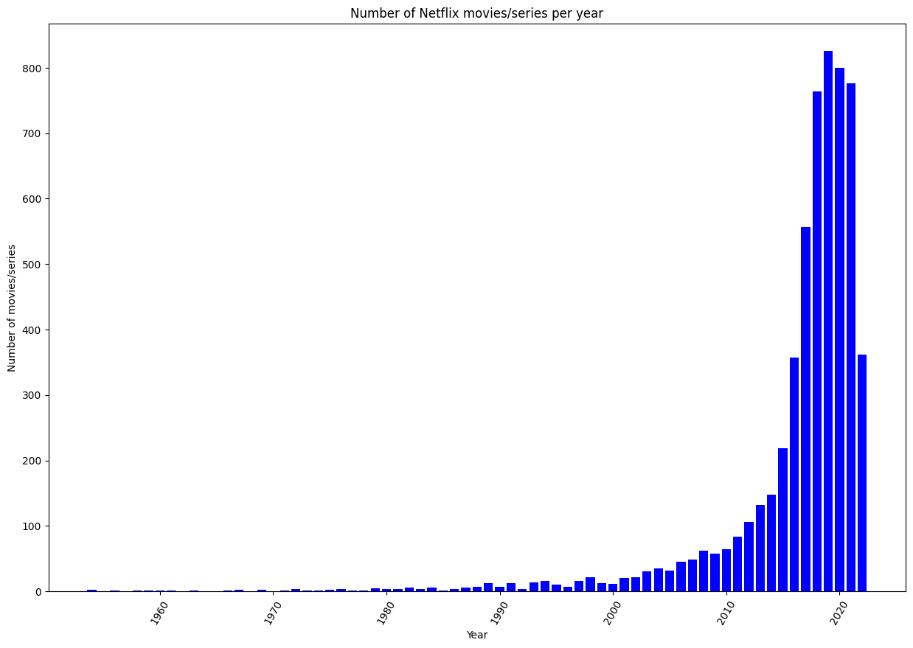
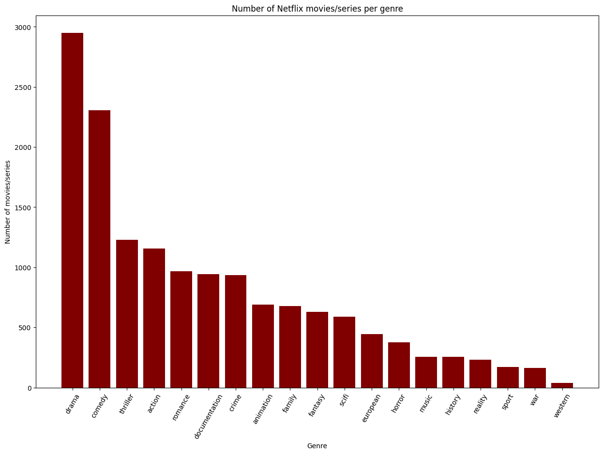
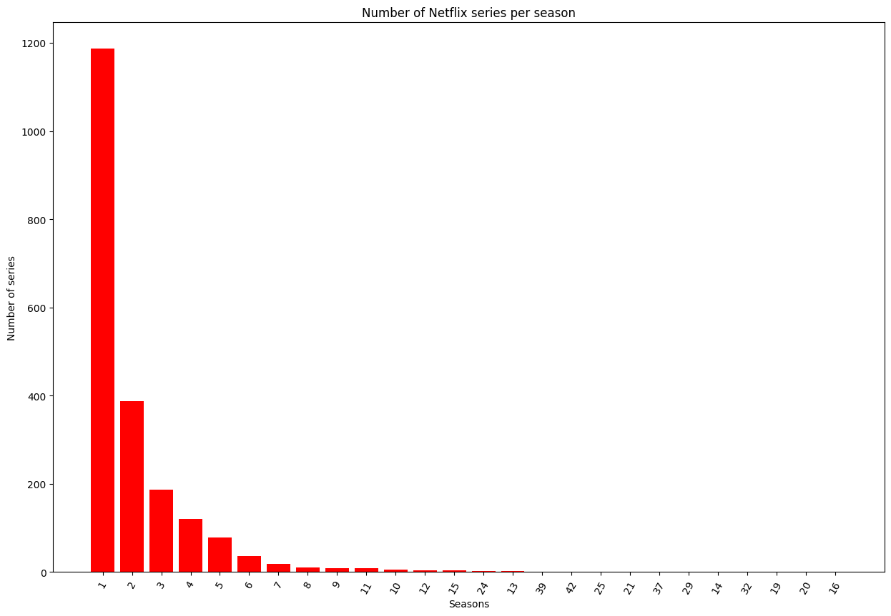
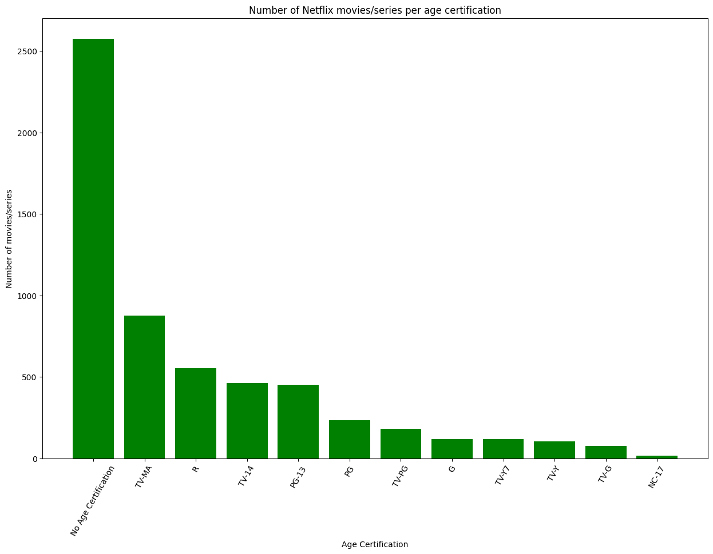
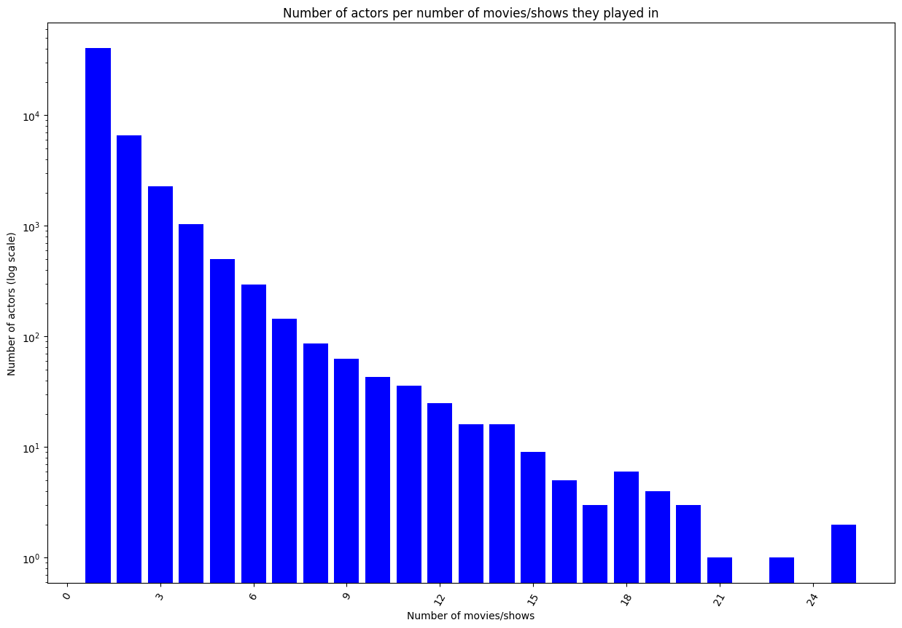
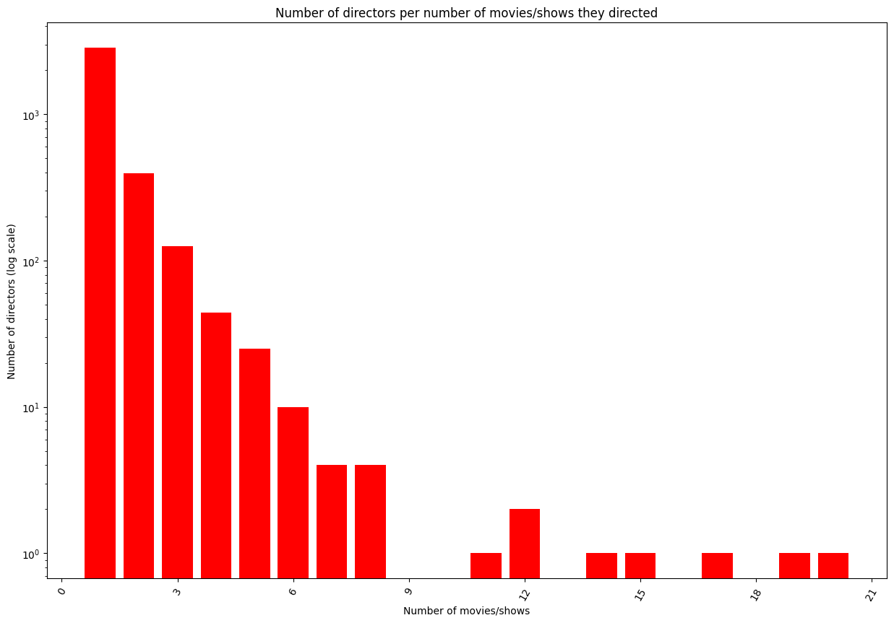
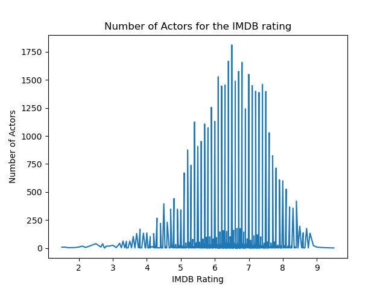
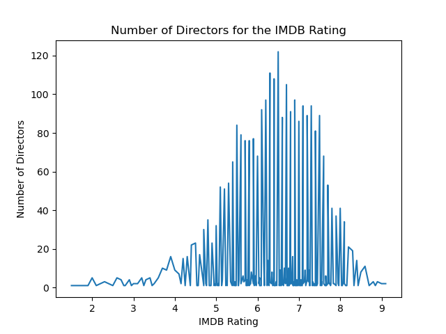

# Project of Data Visualization (COM-480)

| Student's name | SCIPER |
| -------------- | ------ |
| Patrick Louis Aldover | 385753 |
| Jason Mina | 355142 |
| Jérémy Chaverot| 315858 |

[Milestone 1](#milestone-1) • [Milestone 2](#milestone-2) • [Milestone 3](#milestone-3)

## Milestone 1 (29th March, 5pm)

**10% of the final grade**

### Dataset

The main dataset we will be using to conduct our data analysis will be the [Netflix TV Shows and Movies dataset](https://www.kaggle.com/datasets/victorsoeiro/netflix-tv-shows-and-movies?select=credits.csv). This data gathered by Victor Soeiro contains information about Netflix movies and shows and their actors. This dataset was acquired in July 2022 in the US.

The dataset consists of two files. The first file, `titles.csv`, consists of 15 columns:
1. **ID**: the movie/show ID on JustWatch
2. **Title**: the title of the movie/show
3. **Type**: movie/show
4. **Description**: a short description of the movie/show
5. **Release Year**: the release year of the movie/show
6. **Age Certification**: the age certification of the movie/show (if specified)
7. **Runtime**: The duration of the movie or one episode (show)
8. **Genres**: a list of genres
9. **Production Countries**: a list of countries that produced the movie/show
10. **Seasons**: number of seasons (show)
11. **IMDB ID**: the title ID on IMDB
12. **IMDB Score**: the score on IMDB
13. **IMDB Votes**: the votes on IMDB
14. **TMDB Popularity**: the popularity on TMDB
15. **TMDB Score**: the score on TMDB

The second file, `credits.csv`, consists of 5 columns:
1. **Person ID**: the person ID on JustWatch
2. **ID**: the movie/show ID on JustWatch
3. **Name**: the actor’s/director’s name
4. **Character Name**: the character’s name
5. **Role**: actor/director 

The actors in this dataset are already connected via the movie/show IDs. We noticed two things: First, a few movies/shows in the dataset were missing the IMDB/TMDB scores. In that case, we simply omitted those entries from our visualizations. Second, since this dataset contains only movies/shows that were available on Netflix, this dataset does not contain all movies/shows the actor/director participated in from year X to year Y.

Optionally, if we need more information on the actors themselves we will make use of the Kaggle datasets, such as [Top 100 Greatest Hollywood Actors of all Time](https://www.kaggle.com/datasets/iamsouravbanerjee/top-100-greatest-hollywood-actors-of-all-time), focusing on top 100 hollywood actors along with their date of birth and nominations they received.
### Problematic

Everything Everywhere All At Once is a science-fiction, fantasy comedy-drama movie streaming on Netflix. For its originality and the plethora of themes it explores such as philosophy, existentialism and absurdism, the movie won several prizes. Among others, Michelle Yeoh’s performance garnered universal critical acclaim, earning her the Oscar for “Best Actress”. 
Since we often use Netflix to watch our favorite movies and shows, we decided to focus on Netflix movies and shows, which constitutes an original approach to the subject. Indeed Netflix comes in as a new important place for the movie industry. Nowadays, movies don’t necessarily even premiere in theaters anymore; their global release can happen solely on Netflix. Take, for example, Don’t Look Up, a $75 million-budget film released in 2021 starring Leonardo DiCaprio, Jennifer Lawrence and Thimothée Chalamet.

Recently, we have encountered a new generation of actors propelled by Netflix, for instance Millie Bobby Brown or Jenna Ortega. One can argue that their celebrity can be attributed to the quality of their performances in their respective movies and shows, but that would be a shallow analysis. Reflecting on it, it would be intriguing to delve into the data at our disposal, and discover what are the keys of the success in the career of an actor. 
This project aims to take a closer look, and to quantify the influence of various factors concerning the actors, such as the number of nominations and co-stars, on the success of a movie or show. Another track which would be quite interessant to investigate would be the bad performing movies and shows containing famous actors, to evaluate if one could charge them for some reasons (for instance Babylon by Damien Chazelle, which despite starring very famous actors happened to be a commercial disaster).

Our visualization will give a comprehensible insight on the impact of actors on the movie’s or show’s success. By viewing the visualizations of an actor’s influence on the movie or TV industry, viewers can make up their mind whether an upcoming movie or show will be perceived well or not. Our illustrations also highlight which co-actors worked especially well with actors. 

We mainly target three groups. First and foremost, movie and show enthusiasts can use our visualizations to discover (possibly new) actors that had a positive impact on the movies and shows they starred in. Conversely, these enthusiasts can take a look at our visualized pre-processed data to be aware of actors that negatively influenced previous movies and shows. Our second target group involves movie and TV critics. Similar to movie and show enthusiasts, they can utilize our visualizations to assist them to write reports and articles about an actor’s (un)favorable movie/TV history. Finally, we developed our visualization website also for the statistical aspect: Our illustration can assist researchers to determine key factors of a movie’s or show’s success.

### Exploratory Data Analysis

After pre-processing the data (by removing entries with no IMDB/TMDB scores), we end up with 5762 Netflix movies/series. Out of these, 2069 are shows and 3693 are movies. The movies consists of 19 different genres and were produced across 108 countries. The dataset consists of 51544 actors and 3457 directors.

Below are the illustrations of basic statistics regarding the data:

")

### Related work

Our project idea was mainly inspired by a few articles. Our first inspiration came from an article of the New York Times listing the [25 greatest actors of all time](https://www.nytimes.com/interactive/2020/movies/greatest-actors-actresses.html). While this article did not have plots and interactive visuals to provide reasonable arguments for the ranking, it motivated us to visualize the actor’s success on movie/show. An article of Forbes compared [Leonardo DiCaprio to other “Best Actor” Oscar award winners](https://www.forbes.com/sites/nickdesantis/2016/02/27/plotting-leonardo-dicaprio-against-15-years-of-best-actor-oscar-winners-infographic/). Based on their visualization of the actors’ total domestic lifetime gross for their award-winning movies, the author of this article discussed why Leonardo DiCaprio deserved an Oscar. The final article we were inspired by was from [Kevin Chen](https://medium.com/web-mining-is688-spring-2021/network-graphs-of-actors-based-on-popular-movies-in-common-69d30e7b5e07). The author focused on creating a network graph between actors in Python to determine which actors were the most involved with other actors.

As far as we know, we are the only group that uses this dataset. We do recognize that previous groups also created visualizations for movies. But instead on focusing on the movie [revenue](https://github.com/com-480-data-visualization/com-480-project-vizzybussy/blob/master/process_book.pdf) or the [ethnicity](https://github.com/epfl-ada/ada-2023-project-draco?tab=readme-ov-file) of the actors, we plan on visualizing the data in a different way by focusing more on the actor's success of movies or shows and their (un)successful collaboration with other actors. 

## Milestone 2 (26th April, 5pm)

**10% of the final grade**

Website draft: [netflix-scrapers.vercel.app](https://netflix-scrapers.vercel.app)

## Milestone 3 (31st May, 5pm)

**80% of the final grade**

## Late policy

- < 24h: 80% of the grade for the milestone
- < 48h: 70% of the grade for the milestone

